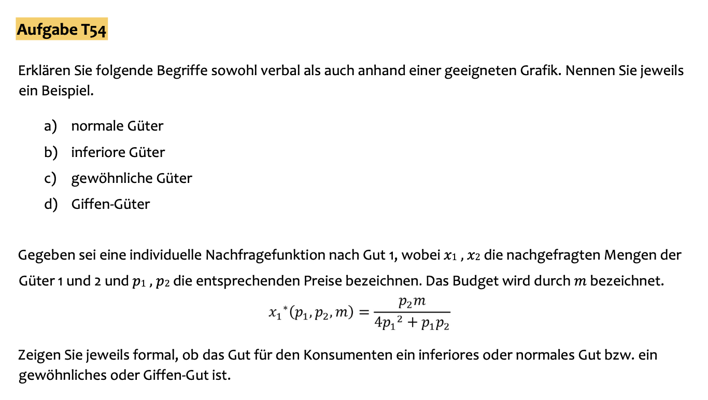
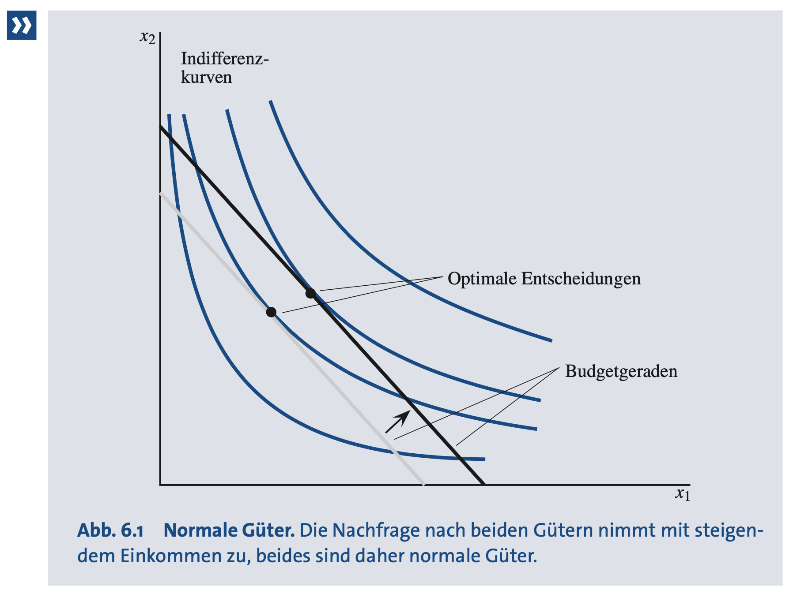
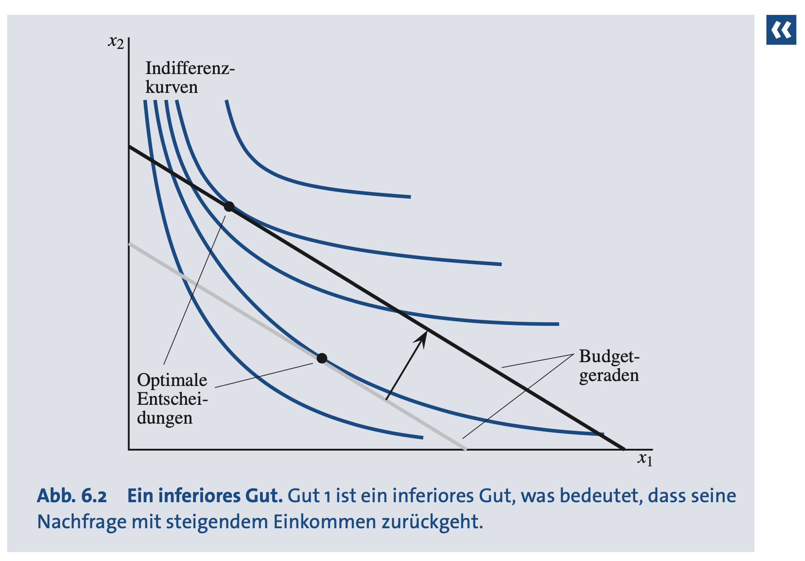
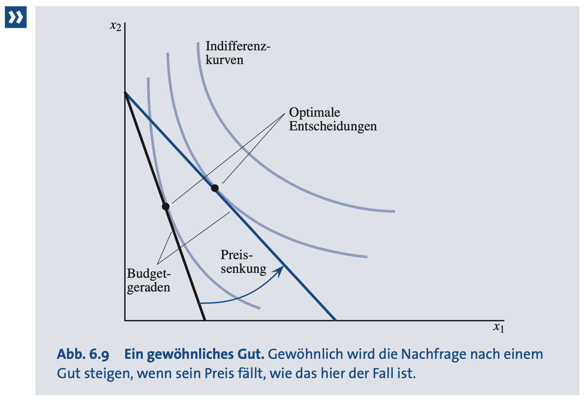
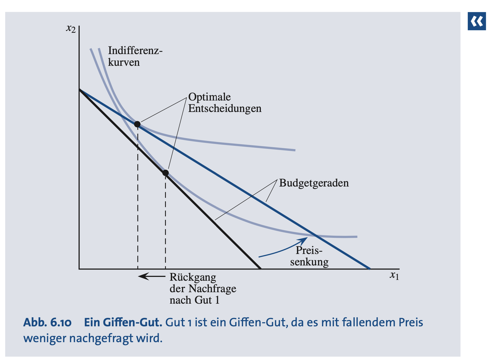
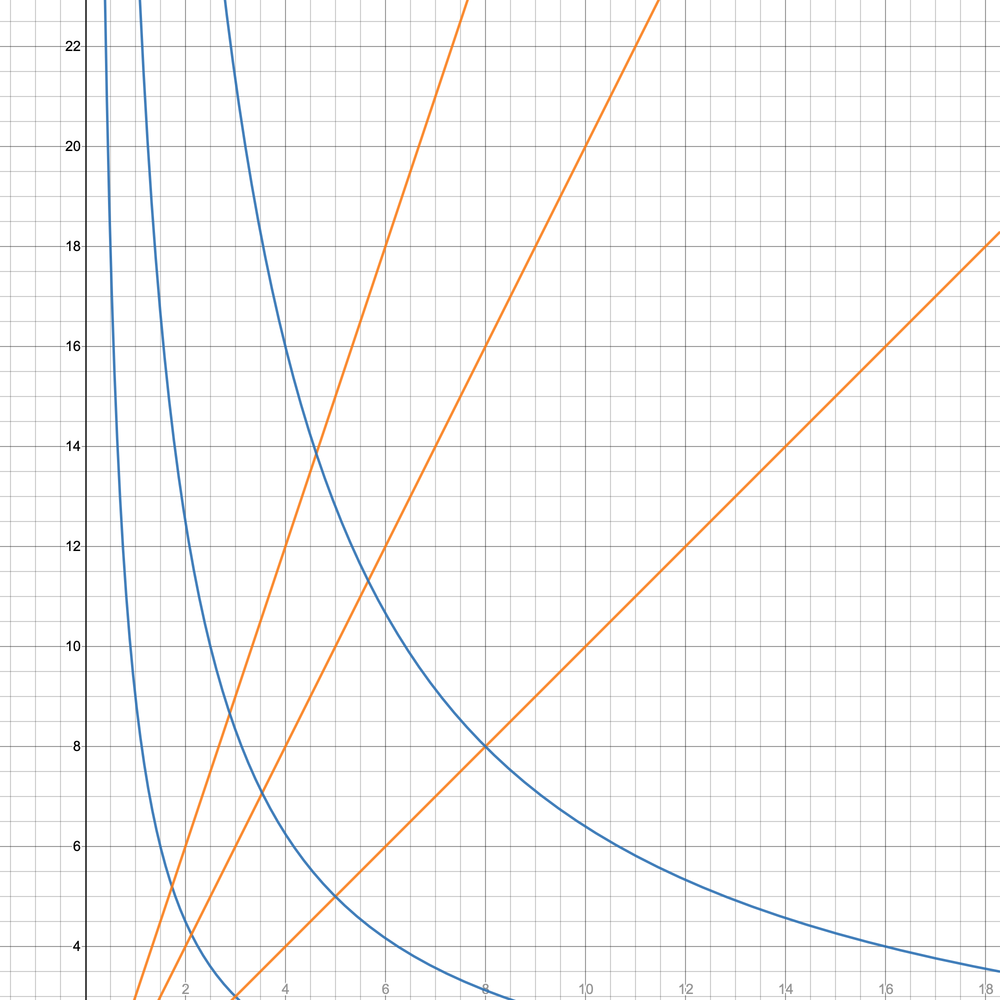
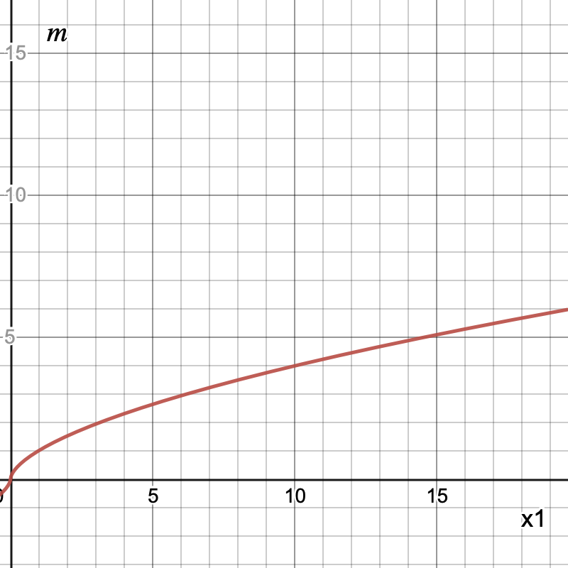
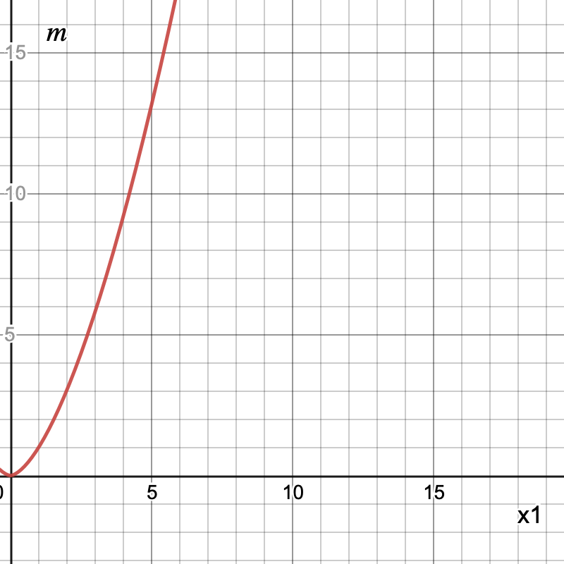
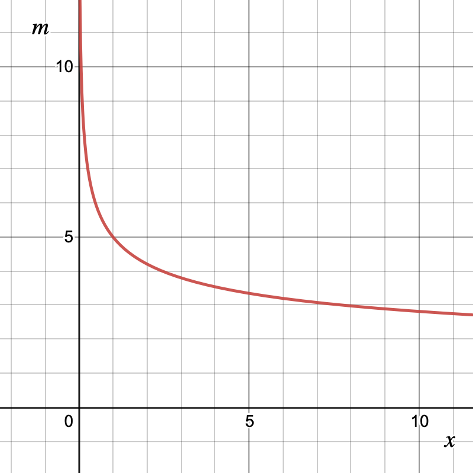

a) **Normale Güter**

$$
\frac{\Delta x}{\Delta m} \gt 0
$$

Eine Steigerung des Einkommens führt zu einer Steigerung der Nachfrage nach dem Gut.

*Beispiel*: Je höher mein Einkommen, desto mehr Schokoriegel kaufe ich mir.

b) **Inferiore Güter**

$$
\frac{\Delta x}{\Delta m} \lt 0
$$

Eine Steigerung des Einkommens führt zu einer Verringerung der Nachfrage nach dem Gut.

*Beispiel:* Alle Substandard-Güter, da bei höherem Einkommen nun qualitativ bessere Güter gekauft werden können und auf die schlechteren Güter verzichtet wird; z.B. Substandard-Wohnungen im Ghetto-Viertel (obwohl das natürlich wortwörtlich auf die Perspektive ankommt).

c) **Gewöhnliche Güter**

$$
\frac{\Delta x}{\Delta p} \lt 0
$$

Eine Preissteigerung führt zu einem Nachfragerückgang. 

*Beispiel*: Steigt der Preis für Schokoriegel, kaufe ich weniger davon.

d) **Giffen-Güter**

$$
\frac{\Delta x}{\Delta p} \gt 0
$$

Eine Preissteigerung führt auch zu einer Steigerung der Nachfrage.

*Beispiel*: Mein Budget beträgt 5€, davon kaufe ich mir 2 Käse für je 2€ und 1 Brot für 1€. Wenn der Brotpreis jetzt von 1€ auf 1.50€ steigt, habe ich nicht mehr genügend Geld für 2 Käse und kaufe stattdessen 2 Brot je 1.50€ und 1 Käse für 2€.

Letzte Teilaufgabe )

$x_1^*(p_1, p_2, m)=\frac{p_2m}{4p_1^2+p_1p_2}$

- *Normales/inferiores Gut*:

Wir können zuerst überprüfen, ob $\frac{\Delta x}{\Delta m} \gt 0$ gilt:

$$
\frac{\partial x_1(p_1, p_2, m)}{\partial m}=\frac{p_2}{4p_1^2+p_1p_2} \gt 0\ \forall \  p_1,p_2 \gt 0
$$

Also ist das Gut *normal*.

- *Gewöhnliches/Giffen-Gut*:

Wir überprüfen, ob $\frac{\Delta x}{\Delta p} \lt 0$ gilt:

$$
\frac{\partial x_1(p_1, p_2, m)}{\partial p_1}=
\frac{-p_2m(8p_1+p_2)}{(4p_1^2+p_1p_2)^2} \lt 0\ \forall \  p_1,p_2 \gt 0 \ 
$$

$$
\text{[Zur Ableitung gebrochenrationaler Funktionen:]}
\\
f(x)=\frac{g(x)}{h(x)} \implies f'(x)=\frac{h(x)*g'(x)-g(x)*h'(x)}{[h(x)]^2}
$$

Also ist das Gut gewöhnlich.

Wir wissen bereits zuvor, dass es sich um normale Präferenzen handelt, da die Präferenzen homothetisch sind:

$$x_1(p_1,p_2,m)=x_1(p_1,p_2,1)m$$

Homothetische Präferenzen bedeuten, dass die Nachfrage nach Gütern nur von dessen Verhältnis zueinander abhängig ist, nicht aber von bspw. dem Einkommen. 

Das heißt, anders als bei ***Luxusgütern***, wo bei steigendem Einkommen die Nachfrage überproportional steigt, und bei ***notwendigen Gütern***, wo bei steigendem Einkommen die Nachfrage überproportional sinkt.

### Formal

Eine Funktion ist ***homogen** vom Grad g*, falls für $k \in \mathbb{R}_{++}$ gilt:

$$
f(kx, ky)=k^gf(x,y)\text{ bzw. }
\\
f(kx_1,kx_2,...,kx_n)=k^gf(x_1,x_2,...,x_n).
$$

Also ist eine Funktion $f:\mathbb{R}^n\mapsto\mathbb{R}$ ist homogen vom Grad 1, wenn $f(kx)=kf(x)\ \forall\ k \gt 0.$

Eine Funktion ist ***homothetisch***, falls es eine *monotone Transformation* einer homogenen Funktion des Grades 1 gibt. Somit ist jede *homogene* Funktion *homothetisch*, aber nicht jede *homothetische* Funktion *homogen*.

Bspw. ist $f(x_1, x_2)=x_1x_2+10$ eine homothetische Funktion, wo $u(x_1, x_2)=x_1x_2$ und $g(v)=v+10$, aber nicht homogen.

Präferenzen, die durch eine homothetische Funktion abgebildet werden können, werden ***homothetische Präferenzen*** genannt.

### Eulers Gesetz

Ist $f$ eine diff'bare Funktion, die homogen des Grades 1 ist, dann:

$$
f(x)=\sum_{i=1}^{n}{\frac{\partial f(x)}{\partial x_i}x_i}.
$$

Damit gilt auch 

$$
\sum_{i}{\frac{\partial f(tx)}{\partial f(tx_i)}x_i}=f(x).
$$

Falls wir $t=1$ setzen, erhalten wir das gewünschte Ergebnis, bspw. $u(x_1, x_2)=\sqrt{tx_1tx_2}:$

$$
\frac{\partial u(tx_1, tx_2)}{\partial tx_1}x_1+\frac{\partial u(tx_1, tx_2)}{\partial tx_2}x_2=(0.5tx_2^{0.5}x_1^{-0.5})x_1+(0.5tx_1^{0.5}x_2^{-0.5})x_2=t\sqrt{x_1x_2}
$$

Wir nehmen an, dass die *MRS/GRS* für homothetische Präferenzen sei homogen vom Grad 0, also gelte:

$$
MRS(\lambda x_1, \lambda x_2)=\lambda^0MRS(x_1, x_2)=MRS(x_1,x_2)
$$

Außerdem ist $\partial f(x)/\partial x_i$ homogen vom Grad $k-1$, falls $f(x)$ eine homogene Funktion vom Grad $k \geq 1$ ist:

$$f(tx)=t^kf(x)\ \forall\ k \ge 1 \land t \gt 0.
\\
\implies f_{x_i}(tx)*t=t^kf_{x_i}(x)
\implies f_{x_i}(tx)=t^{k-1}f_{x_i}(x)
$$

Somit ist bei homothetischen Funktionen (die per Definition eine (monotone Transformation) einer homogenen Funktion des Grades 1 sind) jede partielle Ableitung stets eine homogene Funktion vom Grad 0, d.h. die *MRS* als Quotient zweier homogener Funktionen vom Grad 0 (der partiellen Differentiale der Nutzenfunktion) ist somit immer homogen vom Grad 0:

$$
\frac{\partial f(tx)/\partial x_i}{\partial f(tx)/\partial x_j}=\frac{\partial f(x)/\partial x_i}{\partial f(x)/\partial x_j}
$$

Damit ist die obige Annahme bewiesen:

$MRS(\lambda x_1, \lambda x_2)=\lambda^0MRS(x_1, x_2)=MRS(x_1,x_2)$

Das heißt, entlang einer linearen Funktion durch den Ursprung (also einer linearen homogenen Funktion des Grades 1) ist die MRS immer gleich: 

Cobb-Douglas-Präferenzen.

Somit wird bei konstanten Preisen $p_1$ und $p_2$ bei jeglicher Einkommensänderung die *MRS* gleich bleiben, da wir wissen, dass im Haushaltsoptimum gilt $|MRS|=|PV|$.

Damit ist die ***Einkommens-Konsumkurve*** eine Gerade durch den Koordinatenursprung.

Dies lässt sich auch bei Betrachtung der Nachfragefunktion erkennen (bspw. anhand Cobb-Douglas Präferenzen):

$x_1(m)=\frac{a}{p_1}m$. 

Bei konstantem Preis ist diese Funktion auch homothetisch sowie homogen (und damit vom Grad 1), hat somit eine konstante Steigung und verläuft linear durch den Koordinatenursprung.

Damit hat auch die ***Engel-Kurve*** die gleichen Eigenschaften (homothetisch und homogen):

$m(x_1)=\frac{p_1}{a}x_1$.

Allgemein bieten homothetische Präferenzen also eine lineare Einkommens-Konsumkurve und Engel-Kurve durch den Koordinatenursprung. Zu homothetischen Präferenzen zählen demnach z.B. Cobb-Douglas-Präferenzen, perfekte Substitute und perfekte Komplemente. 

In der Realität müssen Präferenzen nicht homothetisch sein (sondern bspw. **Luxusgüter** und **Notwendigkeitsgüter**):

Engel-Kurve für Luxusgüter. Die nachgefragte Menge steigt überproportional (progressiv) mit steigendem Einkommen. 

Die Nachfrage wächst rascher (überproportional) im Verhältnis zum wachsenden Einkommen.

Je höher das Einkommen, desto mehr Luxusgüter können konsumiert werden.

Engel-Kurve für notwendige Güter. Die nachgefragte Menge steigt unterproportional (degressiv) mit steigendem Einkommen.

Die Nachfrage wächst langsamer (unterproportional) im Vergleich zum wachsenden Einkommen.

Notwendige Güter werden bei größerem nur noch gering mehr nachgefragt, da sie eben nur notwendig sind und kein Luxusgut darstellen.

Engel-Kurve für inferiore Güter. Die nachgefragte Menge sinkt mit zunehmendem Einkommen.
